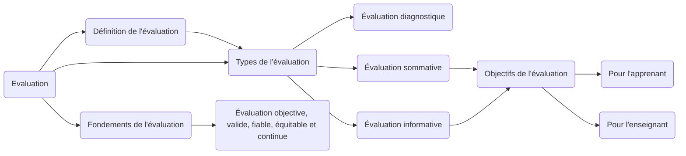

# Évaluation en Enseignement

## Définition de l'évaluation

L'évaluation en enseignement est un processus essentiel qui vise à mesurer et à évaluer les compétences, les connaissances et les aptitudes des apprenants. Elle permet de recueillir des informations sur leur progression et leur performance, afin d'adapter les méthodes d'enseignement et d'améliorer les apprentissages. Dans cet article, nous examinerons la définition de l'évaluation, les types d'évaluation, les objectifs de l'évaluation, les raisons pour lesquelles on évalue, ainsi que les fondements de cette pratique.

## Types de l'évaluation

### Évaluation diagnostique

L'évaluation diagnostique est réalisée en début de formation ou de module. Elle permet de recueillir des informations sur les acquis initiaux des apprenants, afin d'identifier leurs besoins, leurs lacunes et leurs prérequis. L'évaluation diagnostique se base souvent sur des fiches d'évaluation ou des tests spécifiques, qui sont conçus pour mesurer les connaissances et les compétences de base. Les résultats de cette évaluation servent à orienter l'enseignement et à proposer des activités ciblées pour combler les lacunes identifiées.

#### Objectifs

- Identifier le niveau de connaissances et de compétences des apprenants au début de la formation.
- Évaluer les prérequis nécessaires pour aborder le contenu du cours.
- Identifier les lacunes et les difficultés spécifiques des apprenants.
- Personnaliser l'enseignement en fonction des besoins individuels des apprenants.
- Orienter les apprenants vers des ressources ou des activités de soutien adaptées.

### Évaluation sommative

L'évaluation sommative est réalisée à la fin d'une période d'apprentissage ou d'un module. Elle vise à mesurer le niveau de maîtrise des apprenants par rapport aux objectifs d'apprentissage établis. L'évaluation sommative peut prendre la forme de tests, d'examens, de travaux écrits ou de présentations orales. Les résultats de cette évaluation sont généralement utilisés pour attribuer des notes ou des grades aux apprenants et évaluer leur performance globale.

### Évaluation informative

L'évaluation informative est réalisée tout au long du processus d'apprentissage. Elle permet de fournir des retours d'information réguliers aux apprenants sur leurs progrès, leurs points forts et leurs axes d'amélioration. L'évaluation informative se base sur des observations en classe, des discussions, des exercices formatifs, des échanges oraux, etc. Son objectif est de favoriser l'apprentissage en fournissant des indications précises et personnalisées aux apprenants, afin qu'ils puissent s'ajuster et progresser continuellement.

## Objectifs de l'évaluation

Les objectifs de l'évaluation en enseignement sont multiples et variés. Voici quelques-uns des principaux objectifs :

- Mesurer les acquis et la progression des apprenants.
- Identifier les besoins et les lacunes des apprenants.
- Adapter les méthodes d'enseignement en fonction des résultats obtenus.
- Orienter les apprenants dans leur parcours d'apprentissage.
- Fournir des retours d'information aux apprenants pour les aider à s'améliorer.
- Évaluer l'efficacité des programmes d'enseignement et des méthodes pédagogiques.
- Prendre des décisions sur l'orientation scolaire ou professionnelle des apprenants.

## Pourquoi évalue-t-on

### Pour l'apprenant

L'évaluation est importante pour les apprenants car elle leur permet de prendre conscience de leurs progrès, de leurs forces et de leurs faiblesses. Elle leur fournit des retours d'information précieux sur leurs performances, ce qui les aide à s'améliorer et à se fixer des objectifs d'apprentissage. L'évaluation permet également aux apprenants de se situer par rapport à leurs pairs et d'évaluer leur niveau de compétence dans un domaine spécifique.

### Pour l'enseignant

L'évaluation est un outil essentiel pour l'enseignant car elle lui permet de mesurer l'efficacité de son enseignement et d'adapter ses pratiques pédagogiques en conséquence. Les résultats de l'évaluation fournissent des indications sur les points forts et les difficultés des apprenants, ce qui permet à l'enseignant de mieux cibler ses interventions et de proposer des activités adaptées aux besoins de chaque apprenant. L'évaluation aide également l'enseignant à évaluer la pertinence des objectifs d'apprentissage et à ajuster son programme en conséquence.

## Fondements de l'évaluation

L'évaluation en enseignement repose sur certains fondements essentiels. Voici quelques-uns des principes fondamentaux de l'évaluation :

- Objectivité : L'évaluation doit être objective, c'est-à-dire basée sur des critères clairs et mesurables, et exempte de tout biais ou préjugé.
- Validité : L'évaluation doit mesurer ce qu'elle prétend mesurer. Les outils et les méthodes utilisés doivent être valides et pertinents par rapport aux objectifs d'apprentissage.
- Fiabilité : L'évaluation doit être fiable, c'est-à-dire qu'elle doit produire des résultats cohérents et reproductibles. Les outils et les méthodes doivent être standardisés et appliqués de manière constante.
- Équité : L'évaluation doit être équitable, en prenant en compte les différences individuelles des apprenants et en évitant toute discrimination. Les critères d'évaluation doivent être transparents et accessibles à tous.
- Amélioration continue : L'évaluation doit être utilisée comme un outil d'amélioration continue. Elle doit permettre de repérer les axes d'amélioration et de mettre en place des actions correctives.

En conclusion, l'évaluation en enseignement est un processus essentiel qui permet de mesurer et de suivre les progrès des apprenants. Elle vise à fournir des retours d'information aux apprenants et aux enseignants, afin d'améliorer les pratiques pédagogiques et les résultats d'apprentissage. L'évaluation diagnostique, sommative et informative sont autant de types d'évaluation qui répondent à des objectifs spécifiques. En respectant les principes fondamentaux de l'évaluation, nous pouvons garantir une évaluation juste, valide et utile pour tous les acteurs impliqués dans le processus d'enseignement.
