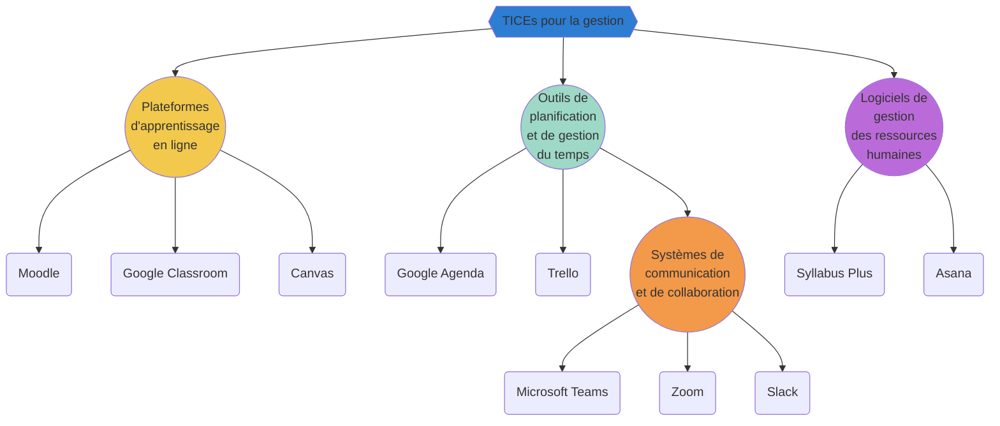
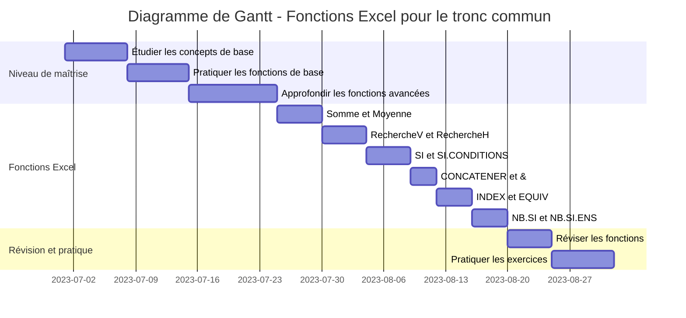

# Compte Rendu **Gestion 2**

_Pr. Rajae Tamri_

import { Download } from "@/components/Download";

<Download />

# Gestion dans l'enseignement

La gestion efficace dans l'enseignement est essentielle pour assurer le bon fonctionnement des activités pédagogiques. Elle implique la gestion du temps, du tableau, de l'espace, des ressources humaines et du contenu. Les interventions professionnelles de l'enseignant comprennent la pédagogie, la communication, l'encadrement et le développement d'attitudes.

## L'importance de la gestion dans l'enseignement

La gestion dans l'enseignement joue un rôle crucial dans la création d'un environnement propice à l'apprentissage. Elle permet de maximiser l'utilisation des ressources disponibles, d'optimiser le temps d'enseignement, de favoriser la collaboration entre les acteurs de l'éducation et d'assurer la qualité du contenu pédagogique.

Une gestion efficace contribue à réduire le stress des enseignants, à améliorer l'engagement des élèves et à favoriser une atmosphère d'apprentissage positive. Elle permet également d'adapter les stratégies pédagogiques en fonction des besoins individuels des élèves et de créer un environnement propice à leur développement global.

## TICES

Pour faciliter la gestion dans l'enseignement, plusieurs applications et technologies peuvent être utilisées. Voici quelques exemples :

- **Plateformes d'apprentissage en ligne** : Moodle, Google Classroom, Canvas.
- **Outils de planification et de gestion du temps** : Google Agenda, Trello, Microsoft OneNote.
- **Systèmes de communication et de collaboration** : Microsoft Teams, Zoom, Slack.
- **Logiciels de gestion des ressources humaines** : Syllabus Plus, Asana.

Ces technologies offrent des fonctionnalités spécifiques pour gérer le contenu pédagogique, organiser les horaires des cours, faciliter la communication entre les enseignants, les élèves et les parents, ainsi que pour la planification des emplois du temps et la gestion des projets et des tâches.

### Exemple d'utilisation des TICEs

## L'apprentissage par pair

L'apprentissage par pair est une méthode d'enseignement dans laquelle les apprenants travaillent en binôme pour résoudre des problèmes, réaliser des activités ou apprendre de nouveaux concepts. Il repose sur la collaboration et l'échange de connaissances entre les membres du binôme. Chaque apprenant joue à la fois le rôle d'apprenant et de tuteur, permettant ainsi un apprentissage actif et mutuel.

L'importance de l'apprentissage par pair réside dans plusieurs aspects. Tout d'abord, il favorise le **développement des compétences** sociales et de communication, car les apprenants doivent interagir, expliquer, argumenter et coopérer pour résoudre les problèmes ensemble. En travaillant en binôme, ils apprennent également à écouter et à comprendre différents points de vue, ce qui enrichit leur perspective.

L'apprentissage par pair permet également d'**améliorer la confiance** en soi et l'estime de soi des apprenants, car ils ont l'occasion d'enseigner et d'aider leurs pairs, renforçant ainsi leur propre compréhension du sujet. De plus, cette méthode favorise l'autonomie et l'initiative des apprenants, car ils sont responsables de leur propre apprentissage et doivent trouver des solutions de manière collaborative.

Enfin, l'apprentissage par pair permet de bénéficier de **la diversité des connaissances**, des **compétences** et des expériences des apprenants. Chaque membre du binôme apporte des perspectives différentes, ce qui enrichit l'apprentissage et **favorise la créativité**.

En résumé, l'apprentissage par pair est une méthode d'enseignement qui favorise la collaboration, le développement des compétences sociales, l'autonomie et l'apprentissage actif. Elle permet aux apprenants d'apprendre les uns des autres et de bénéficier de la diversité des connaissances et des perspectives, ce qui en fait une approche pédagogique importante.

## Les types de motivation

- **Motivation extrinsèque :** Il s'agit de la motivation qui provient de récompenses externes telles que des grades, des récompenses matérielles ou la reconnaissance sociale. Les apprenants sont motivés par des incitations externes à accomplir une tâche ou à atteindre un objectif.

- **Motivation intrinsèque :** C'est la motivation qui provient de l'intérieur de l'individu. Les apprenants sont motivés par leur intérêt personnel pour la tâche, le plaisir qu'ils en retirent, le défi intellectuel ou la satisfaction intrinsèque de l'accomplissement.

### Facteurs de motivation

- **Rétroaction :** Fournir une rétroaction constructive et spécifique aux apprenants sur leurs performances peut les motiver en leur indiquant ce qu'ils font bien et ce qu'ils peuvent améliorer. La rétroaction encourage également l'autonomie et le développement continu.

- **Pertinence :** Lorsque les apprenants peuvent établir des liens entre ce qu'ils apprennent et leur vie réelle, leurs intérêts et leurs objectifs personnels, cela renforce leur motivation en leur montrant la valeur pratique et l'importance de l'apprentissage.

- **Autonomie :** Donner aux apprenants une certaine autonomie dans leur apprentissage, en leur permettant de faire des choix et de prendre des décisions, favorise leur motivation intrinsèque. Cela peut inclure des projets individuels, des opportunités de recherche personnelle ou de l'auto-évaluation.

- **Collaboration :** Encourager la collaboration entre les apprenants en favorisant le travail d'équipe, les discussions et l'apprentissage coopératif peut renforcer leur motivation. La coopération permet aux apprenants de se soutenir mutuellement, d'apprendre des autres et de développer des compétences sociales.

- **Environnement favorable :** Créer un environnement d'apprentissage positif, accueillant et stimulant peut favoriser la motivation des apprenants. Cela peut inclure un climat de classe positif, un enseignant bienveillant, des ressources attractives, et des activités variées et engageantes.

### Maintenir la motivation des apprenants

- **Fixer des objectifs clairs et atteignables :** Des objectifs spécifiques et réalistes aident les apprenants à se concentrer et à suivre leur progression, ce qui maintient leur motivation en leur offrant des étapes à franchir.

- **Varier les méthodes d'enseignement :** Utiliser une variété d'approches pédagogiques, comme des activités pratiques, des jeux, des discussions, des vidéos, des démonstrations, etc., peut maintenir l'intérêt des apprenants et les garder engagés.

- **Favoriser l'apprentissage actif :** Encourager les apprenants à être actifs dans leur apprentissage en posant des questions, en réalisant des projets, en résolvant des problèmes et en participant activement en classe. Cela les implique davantage et maintient leur motivation.

- **Reconnaître les efforts et les réalisations des apprenants**, même les petites avancées, renforce leur motivation et leur confiance en soi.

## Informatique Débranchée

L'informatique débranchée, également connue sous le nom de "coding unplugged" ou "computer science unplugged", fait référence à l'enseignement des concepts fondamentaux de l'informatique sans utiliser d'ordinateurs ou de dispositifs électroniques. Cette approche pédagogique vise à introduire les principes de base de l'informatique de manière pratique et ludique, en utilisant des activités physiques, des jeux de rôles et des manipulations concrètes.

L'informatique débranchée offre plusieurs avantages :

1. **Accessibilité** : Elle ne nécessite pas de matériel informatique spécifique, ce qui la rend accessible à tous les apprenants, indépendamment de leur situation socio-économique ou de leur accès aux technologies.

2. **Compréhension conceptuelle** : En utilisant des activités concrètes et des métaphores, l'informatique débranchée permet aux apprenants de développer une compréhension solide des concepts informatiques fondamentaux tels que les algorithmes, la logique, les boucles, les variables, etc.

3. **Pensée computationnelle** : Elle favorise le développement des compétences de pensée computationnelle, telles que la résolution de problèmes, la logique de programmation et la capacité à décomposer des tâches complexes en étapes plus petites.

4. **Collaboration et communication** : Les activités d'informatique débranchée encouragent la collaboration entre les apprenants, les incitant à travailler ensemble, à communiquer leurs idées et à résoudre des problèmes en équipe.

5. **Apprentissage ludique** : Les activités ludiques et interactives rendent l'apprentissage de l'informatique plus engageant et amusant. Les apprenants sont plus motivés et enthousiastes, ce qui facilite l'acquisition des concepts.

Certaines activités couramment utilisées dans l'informatique débranchée comprennent la création d'algorithmes à l'aide de cartes ou de puzzles, la simulation de réseaux à l'aide de cordes ou de rubans, et la représentation de l'information à l'aide de symboles ou de codes visuels.

L'informatique débranchée peut être utilisée comme une introduction préalable à l'informatique avant de passer à des activités pratiques sur ordinateur, ou comme une approche complémentaire pour renforcer la compréhension conceptuelle et les compétences de pensée computationnelle des apprenants.

## Séance Animé :

### Cours

  <iframe
    loading="lazy"
    class="absolute left-0 top-0 m-0 h-full w-full border-[none] p-0"
src="https:&#x2F;&#x2F;www.canva.com&#x2F;design&#x2F;DAFjoEwqHF0&#x2F;view?embed"

    allowfullscreen="allowfullscreen"
    allow="fullscreen"

> </iframe>

### Fiche

### Groupes

