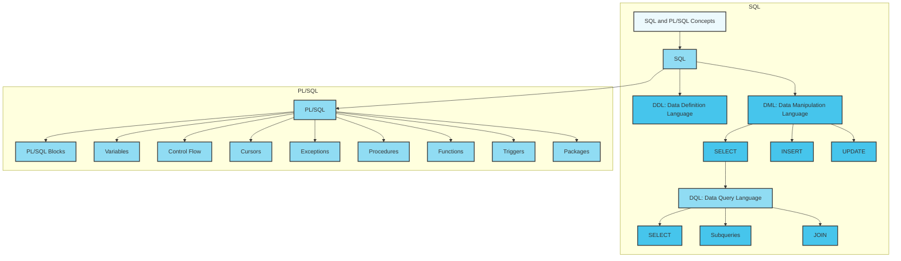
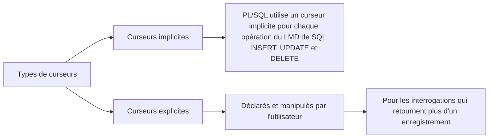
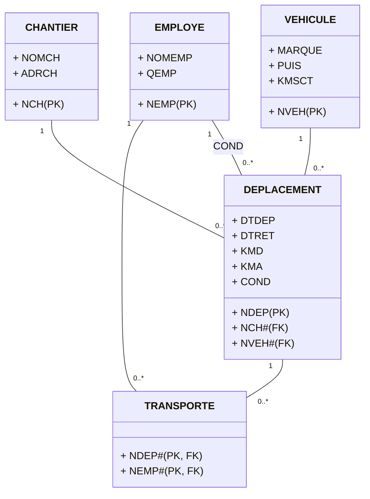

# Les base Données / **SQL**

_Pr. Si Mohammed Snineh_

import { Download } from "@/components/Download";

<Download />



## Syntaxe de base

### Création d'une table

La création d'une table est une étape fondamentale en SQL. Voici un exemple de syntaxe pour créer une table :

```sql
CREATE TABLE nom_table (
  colonne1 datatype1,
  colonne2 datatype2,
  ...
);
```

# contraintes dans Oracle SQL

## Contrainte de clé primaire (Primary Key)

- Une contrainte de clé primaire garantit l'unicité et l'identifiant d'une ligne dans une table. Elle est souvent utilisée pour définir une colonne ou un groupe de colonnes qui identifie de manière unique chaque enregistrement dans une table.

#### Exemple :

```sql
CREATE TABLE MaTable (
  id NUMBER PRIMARY KEY,
  nom VARCHAR2(50)
);
```

#### Contrainte d'intégrité référentielle (Foreign Key)

    La contrainte d'intégrité référentielle garantit que les valeurs d'une colonne dans une table (table enfant) correspondent aux valeurs d'une autre colonne dans une autre table (table parente). Elle est utilisée pour établir des relations entre les tables.

#### Exemple :

```sql

CREATE TABLE TableEnfant (
  id NUMBER PRIMARY KEY,
  id_parent NUMBER,
  nom VARCHAR2(50),
  CONSTRAINT fk_id_parent FOREIGN KEY (id_parent) REFERENCES TableParent(id)
);
```

Contrainte d'unicité (Unique)

    La contrainte d'unicité garantit que les valeurs d'une colonne sont uniques dans une table. Elle est utilisée pour s'assurer qu'aucune valeur en double ne peut être insérée dans la colonne spécifiée.

#### Exemple :

```sql

CREATE TABLE MaTable (
  id NUMBER PRIMARY KEY,
  code VARCHAR2(10) UNIQUE,
  nom VARCHAR2(50)
);
```

#### Contrainte de vérification (Check)

    La contrainte de vérification définit une condition qui doit être satisfaite pour toutes les lignes d'une table. Elle est utilisée pour restreindre les valeurs acceptables dans une colonne.

#### Exemple :

```sql

CREATE TABLE MaTable (
  id NUMBER PRIMARY KEY,
  age NUMBER,
  CONSTRAINT check_age CHECK (age >= 18)
);
```

#### Contrainte de valeur par défaut (Default)

    La contrainte de valeur par défaut spécifie une valeur par défaut pour une colonne si aucune valeur n'est spécifiée lors de l'insertion.

#### Exemple :

```sql

CREATE TABLE MaTable (
  id NUMBER PRIMARY KEY,
  date_creation DATE DEFAULT SYSDATE
);
```

Note : Les contraintes peuvent être définies lors de la création d'une table ou ajoutées/modifiées ultérieurement en utilisant l'instruction ALTER TABLE. Les contraintes jouent un rôle essentiel dans la garantie de l'intégrité des données et l'application des règles métier dans une base de données Oracle SQL.

Chaque colonne est spécifiée avec un nom et un type de données correspondant.

## Contrainte apres creation des tables

Les contraintes dans Oracle SQL sont utilisées pour garantir l'intégrité des données dans les tables. Elles définissent des règles ou des conditions que les données doivent respecter. Voici une vue d'ensemble des principales contraintes et des exemples de snippets SQL pour les ajouter à une table existante.

#### Contrainte de clé primaire (Primary Key) :

    La contrainte de clé primaire garantit l'unicité et l'identifiant d'une ligne dans une table.

```sql
ALTER TABLE MaTable
ADD CONSTRAINT pk_id PRIMARY KEY (id);
```

#### Contrainte d'intégrité référentielle (Foreign Key) :

    La contrainte d'intégrité référentielle garantit que les valeurs d'une colonne dans une table correspondent aux valeurs d'une autre colonne dans une autre table.

```sql

ALTER TABLE TableEnfant
ADD CONSTRAINT fk_id_parent FOREIGN KEY (id_parent)
REFERENCES TableParent(id);
```

#### Contrainte d'unicité (Unique) :

    La contrainte d'unicité garantit que les valeurs d'une colonne sont uniques dans une table.

```sql

ALTER TABLE MaTable
ADD CONSTRAINT uc_code UNIQUE (code);
```

#### Contrainte de vérification (Check) :

    La contrainte de vérification définit une condition qui doit être satisfaite pour toutes les lignes d'une table.

```sql

ALTER TABLE MaTable
ADD CONSTRAINT check_age CHECK (age >= 18);
```

#### Contrainte de valeur par défaut (Default) :

    La contrainte de valeur par défaut spécifie une valeur par défaut pour une colonne si aucune valeur n'est spécifiée lors de l'insertion.

```sql

ALTER TABLE MaTable
MODIFY (date_creation DEFAULT SYSDATE);
```

Ajouter des contraintes après la création de la table :
Pour ajouter des contraintes à une table existante, vous pouvez utiliser l'instruction ALTER TABLE avec la clause ADD CONSTRAINT.

```sql

ALTER TABLE MaTable
ADD CONSTRAINT fk_tableA_id FOREIGN KEY (tableA_id) REFERENCES TableA(id);
```

### Insertion d'un enregistrement

Pour insérer un nouvel enregistrement dans une table, on utilise la commande `INSERT INTO`. Voici un exemple :

```sql
INSERT INTO nom_table (colonne1, colonne2, ...)
VALUES (valeur1, valeur2, ...);
```

Les valeurs spécifiées correspondent aux données que l'on souhaite insérer.

### Mise à jour des données

La mise à jour des données existantes dans une table se fait avec la commande `UPDATE`. Voici un exemple :

```sql
UPDATE nom_table
SET colonne1 = nouvelle_valeur1, colonne2 = nouvelle_valeur2, ...
WHERE condition;
```

La clause `WHERE` permet de spécifier les enregistrements à mettre à jour.

### Suppression d'enregistrements

La suppression d'enregistrements se fait avec la commande `DELETE FROM`. Voici un exemple :

```sql
DELETE FROM nom_table WHERE condition;
```

La clause `WHERE` est utilisée pour spécifier les enregistrements à supprimer.

### Sélection de données

Pour extraire des données d'une table, on utilise la commande `SELECT`. Voici un exemple :

```sql
SELECT colonne1, colonne2, ...
FROM nom_table
WHERE condition;
```

## LID

## Langage d'interrogation des données

Une requête permet de rechercher des données dans une ou plusieurs tables à partir de critères simples ou complexes.

Une requête est une instruction SELECT.

## Syntaxe SELECT

```sql
SELECT [ { DISTINCT | UNIQUE } | ALL ] listeColonnes
FROM nomTable1 [,nomTable2]…
[ WHERE condition ]
[ GROUP BY col1, col2..]
[ HAVING condition ]
[ { UNION | UNION ALL | INTERSECT | MINUS } ( sousRequête )]
[ ORDER BY col1] ;
```

## Projection : éléments du SELECT

Extraction de toutes les colonnes :

```sql
SELECT * FROM Pilote;
```

Extraction de certaines colonnes :

```sql
SELECT compa, brevet FROM Pilote;
```

Alias : AS

Les alias permettent de renommer des colonnes à l'affichage ou des tables dans la requête.

```sql
SELECT aliasPilotes.compa AS c1, aliasPilotes.nom
FROM Pilote aliasPilotes;
```

Duplicatas

```sql
SELECT compa
FROM Pilote;

SELECT DISTINCT(compa)
FROM Pilote;
```

Eléments calculés

Il est possible d'évaluer et d'afficher simultanément des expressions dans la clause SELECT.

```sql
SELECT brevet, nbHVol, nbHVol*nbHVol AS auCarré, 10*nbHVol+5/2
FROM Pilote;
```

Ordre

Pour trier le résultat d'une requête, il faut spécifier la clause d'ordonnancement par ORDER BY.

```sql
SELECT brevet, nom
FROM Pilote
ORDER BY nom DESC;
```

Concaténation

Il est possible de concaténer des expressions par l'opérateur de concaténation ||.

```sql
SELECT brevet, nom || ' ' || compa AS "Embauche"
FROM Pilote;
```

Clause WHERE : Exemples

Afficher les clients dont la date de naissance n'est pas le 25 décembre 1960 ?

```sql
SELECT *
FROM clients
WHERE naissance <> '25/12/1960';
```

Afficher les clients dont on connaît le code postal ?

```sql
SELECT *
FROM clients
WHERE code_postal IS NOT NULL;
```

Afficher les articles bleus dont le prix est supérieur ou égal à 100 ou inférieur strictement à 10 ?

```sql
SELECT *
FROM articles
WHERE couleur='bleu'
AND (prix >= 100 OR prix < 10);
```

Afficher les articles dont le prix est entre 10 et 100 ?

```sql
SELECT *
FROM articles
WHERE prix BETWEEN 10 AND 100;
```

Afficher les clients qui ne s'appellent ni 'Salah' ni 'Salam' ni 'Alami' ?

```sql
SELECT *
FROM clients
WHERE nom NOT IN ('Salah', 'Salam', 'Alami');
```

Afficher les clients dont le nom commence par A?

```sql
SELECT *
FROM clients
WHERE nom LIKE 'A%';
```

Afficher les clients dont le nom ne contient pas 'm' ?

```sql
SELECT *
FROM clients
WHERE nom NOT LIKE '%m%';
```

### Sous-Requêtes

- Une sous-requête est une requête SELECT utilisée à l'intérieur d'une requête principale.
- La sous-requête doit être délimitée par des parenthèses et ne peut extraire que les colonnes de la table du premier SELECT.
- Les sous-requêtes peuvent renvoyer une valeur scalaire, une colonne ou une table.

#### Sous-requêtes renvoyant une valeur scalaire

- Une sous-requête renvoie une valeur scalaire si elle comporte une seule ligne et une seule colonne.
- Les sous-requêtes scalaires peuvent être utilisées comme une colonne supplémentaire ou pour évaluer des conditions (WHERE ou HAVING).

Exemple de requête avec une sous-requête renvoyant une valeur scalaire :

```sql

SELECT COUNT(*) FROM Fournisseur;
```

#### Sous-requêtes renvoyant une colonne

- Les sous-requêtes renvoyant une colonne peuvent être utilisées avec des opérateurs de comparaison tels que IN, ANY, ALL, etc.
- Les opérateurs multi-lignes permettent de comparer un élément avec une liste de valeurs renvoyée par la sous-requête.

##### Exemple de requête avec une sous-requête renvoyant une colonne :

```sql
SELECT *
FROM Commandes
WHERE client IN (SELECT numero
                 FROM Clients
                 WHERE dateNaiss = '21/03/1970');
```

#### Exemple de requête avec une sous-requête renvoyant une colonne et utilisant l'opérateur ALL :

```sql
SELECT *
FROM Articles
WHERE prix >= ALL (SELECT prix
                   FROM Articles
                   WHERE couleur = 'bleu');
```

#### Exemple de requête avec une sous-requête renvoyant une colonne et utilisant l'opérateur ANY :

```sql
SELECT *
FROM Articles
WHERE prix > ANY (SELECT prix
                  FROM Articles
                  WHERE couleur = 'bleu');
```

#### Opérateur EXISTS

- L'opérateur EXISTS permet de vérifier l'existence d'enregistrements renvoyés par une sous-requête.
- Il peut être utilisé pour effectuer des filtrages conditionnels.

##### Exemple de requête avec l'opérateur EXISTS :

```sql
SELECT *
FROM client
WHERE EXISTS (SELECT *
              FROM commandes
              WHERE client.numero = commandes.client
                AND commandes.date = '13/5/2010');
```

##### Sous-requêtes corrélées

- Une sous-requête corrélée est évaluée pour chaque ligne de la requête principale.
- Elle permet de lier les résultats de la sous-requête aux valeurs de la requête principale.

### Exemple de requête avec une sous-requête corrélée :

```sql
SELECT a.article, a.quantite, b.client
FROM lignes_commande a, commandes b
WHERE a.article = b.numero
  AND (a.article, a.quantite) IN
      (SELECT article, MAX(quantite)
       FROM lignes_commande
       GROUP BY article);
```

## Vues

Les vues sont utilisées pour restreindre l'accès à certaines données d'une table en créant une table virtuelle à partir d'une ou plusieurs tables existantes. Les vues agissent comme des fenêtres à travers lesquelles seules les données spécifiques sont visibles.

### Exemple de création d'une vue :

```sql

CREATE VIEW ma_vue AS
SELECT colonne1, colonne2
FROM table
WHERE condition;
```

#### Manipulation des vues

Les vues peuvent être manipulées comme des tables normales, c'est-à-dire qu'on peut effectuer des opérations d'insertion, de modification et de suppression sur les données de la vue. Les modifications sont propagées à la table d'origine si les conditions sont remplies.

#### Exemple d'insertion dans une vue :

```sql

INSERT INTO ma_vue (colonne1, colonne2)
VALUES (valeur1, valeur2);
```

#### Mise à jour des vues

Les vues peuvent être mises à jour à l'aide de requêtes de mise à jour, qui se traduiront par des modifications dans la table d'origine si les conditions sont remplies.

#### Exemple de mise à jour d'une vue :

```sql

UPDATE ma_vue
SET colonne1 = nouvelle_valeur
WHERE condition;
```

#### Requêtes avec vues

Les vues peuvent être utilisées dans des requêtes pour simplifier les opérations et faciliter l'accès aux données restreintes.

#### Exemple de requête avec vue :

```sql

SELECT *
FROM ma_vue
WHERE condition;
```

#### Contrôle de mise à jour

Il est possible de contrôler les mises à jour sur une vue en utilisant les clauses WITH CHECK OPTION ou WITH READ ONLY lors de la création de la vue. Ces clauses permettent de spécifier les conditions dans lesquelles les modifications sont autorisées ou non.

Exemple de création d'une vue en lecture seule :

```sql

CREATE VIEW ma_vue_readonly AS
SELECT colonne1, colonne2
FROM table
WHERE condition
WITH READ ONLY;
```

## Déclencheurs"

### C'est quoi un déclencheur?

Un déclencheur, également appelé "trigger" en anglais, est un bloc de code PL/SQL qui est invoqué automatiquement à chaque fois qu'un événement spécifique se produit dans une base de données Oracle. Ces événements sont généralement liés aux manipulations des données d'une table, telles que l'insertion, la suppression ou la modification d'une ligne. Les déclencheurs ont un nom, une partie déclaration, un corps et une partie exception. Ils sont exécutés de manière transparente par Oracle, sans nécessiter d'appel explicite de la part de l'utilisateur.

### Utilité des déclencheurs

Les déclencheurs peuvent être utilisés dans différentes situations, notamment :

- Implémenter des contraintes d'intégrité complexes qui ne peuvent pas être définies comme des contraintes déclaratives d'une table.
- Gérer l'audit en enregistrant les modifications effectuées sur une table.
- Effectuer automatiquement une action lorsqu'une autre action se produit, par exemple mettre à jour une table lorsqu'une nouvelle ligne est insérée dans une autre table.
- Maintenir des valeurs dérivées, par exemple en maintenant un stock d'actions sans avoir à le modifier directement.
- Archiver des données, permettant un accès facile aux données archivées via des déclencheurs.

### Types de déclencheurs

Les déclencheurs peuvent être classés en deux catégories :

1. Déclencheurs de synchronisation :

   - BEFORE : déclenchés avant l'exécution de l'instruction qui a activé le déclencheur.
   - AFTER : déclenchés après l'exécution de l'instruction.

2. Déclencheurs d'événement :
   - INSERT, UPDATE et DELETE : déclenchés en fonction du type d'instruction qui a activé le déclencheur.

### Création d'un déclencheur

Pour créer un déclencheur dans une base de données Oracle, on utilise la commande `CREATE TRIGGER` avec les éléments suivants :

- Nom du déclencheur.
- Table associée au déclencheur.
- Moment où le déclencheur est activé : BEFORE ou AFTER.
- Commande qui active le déclencheur : INSERT, UPDATE ou DELETE.
- Condition de filtrage (optionnelle).
- Bloc PL/SQL à exécuter lorsque le déclencheur est activé.

### Exemple de création d'un déclencheur

```sql
CREATE OR REPLACE TRIGGER nom_trigger
BEFORE INSERT
ON nom_table
FOR EACH ROW
BEGIN
    -- Bloc de code PL/SQL à exécuter
    -- lorsque le déclencheur est activé
END;
```

### Activation et désactivation des déclencheurs

Un déclencheur peut être activé ou désactivé selon les besoins. Pour cela, on utilise les commandes ALTER TRIGGER et ENABLE ou DISABLE. Par exemple :

    - `ALTER TRIGGER nom_trigger DISABLE;` pour désactiver un déclencheur.
    - `ALTER TRIGGER nom_trigger ENABLE;` pour activer un déclencheur.

Suppression d'un déclencheur

Pour supprimer un déclencheur, on utilise la commande DROP TRIGGER suivie du nom du déclencheur à supprimer. Par exemple :

    - DROP TRIGGER nom_trigger; pour supprimer un déclencheur.

_Sidi Mohamed SNINEH_

## AVANTAGES

Les principaux avantages de PL/SQL sont :

- La modularité :

  - Procédures, fonctions cataloguées, ….
  - Réutilisables et contrôlables.

- La portabilité : un programme PL/SQL est indépendant du système
  d’exploitation qui héberge le serveur Oracle.
- L’intégration avec les données des tables : on retrouvera avec PL/SQL
  tous les types de données et instructions disponibles sous SQL, et des
  mécanismes pour parcourir des résultats de requêtes (curseurs), pour
  traiter des erreurs (exceptions), pour manipuler des données
  complexes.

## STRUCTURE D’UN BLOC PL/SQL

```sql

DECLARE
-- Déclaration types, constantes, variables,…
BEGIN
-- Instructions PL/SQL (et SQL-LMD)
EXCEPTION
-- Traitement des erreurs ]
END;
/
```

- les sections DECLARE et EXCEPTION sont facultatives.
- chaque instruction se termine par un ;
- Les commentaires :
  - monolignes, commençant au symbole -- et finissant à la fin de la ligne
  - multilignes, commençant par /_ et finissant par _/

| N° vol | N° Pilote | N° Avion | VilleD | VilleA | HD   | HA   | DateV      |
| ------ | --------- | -------- | ------ | ------ | ---- | ---- | ---------- |
| 100    | 1         | 1        | Rak    | Casa   | 1345 | 1500 | 03/11/2003 |
| 110    | 2         | 5        | Rak    | Fes    | 0815 | 1020 | 12/01/2004 |

**Ajout d’un vol Rak - Fes :**

```sql
SET SERVEROUTPUT ON;
-- Charge le package DBMS_OUTPUT dans la session SQL*Plus
BEGIN
insert into vol values (110,2, 5, 'Rak','Fes','0815','1020',SYSDATE);
DBMS_OUTPUT.PUT_LINE('Données Enregistrées');
END;
/
-- Le caractère « / » termine un bloc pour son exécution dans
-- l’interface SQL*Plus.
```

**Exécution en SQl\*Plus .**

```shell
SQL> start Ajout_Vol.sql;
```

## TYPES DE DONNÉES

### Types simples (scalaires)

- Char,Char(n),Varchar2(n),…
- Integer, Natural, Number, Number(n), Float, Real, Number(n, m),…
- Boolean
- Date

### Types composites

- Record
- Table
- Varray

### Types références

```sql
REF <type objet>
```

### Types LOB (« Large Objects »)

- BFILE
- BLOB, CLOB, NCLOB

## VARIABLES ET CONSTANTES

Déclaration dans la partie déclarative d’un bloc PL/SQL

**Syntaxe :**

```sql
Identifiant [CONSTANT] type de donnée [NOT NULL]
[:= | DEFAULT expression]
```

**Exemples :**

- Variables

```sql
  DECLARE
  v_date DATE;
  v_num NUMBER(2) NOT NULL :=0 ; -- initialisation à zéro
  v_num INTEGER DEFAULT 0; -- idem
  trouve BOOLEAN DEFAULT TRUE;
  ville VARCHAR(10) NOT NULL :=’marrakech’;
```

- Constantes

```sql
DECLARE
v_salaire CONSTANT REAL := 5000.00;
```

## AFFECTATIONS

Il existe plusieurs possibilités pour affecter une valeur à une variable :

- par l’opérateur de l’affectation `:=`
- par la directive `DEFAULT` ;

- par la directive `INTO` d’une requête (`SELECT … INTO variable FROM` …).

### TYPES DE DONNÉES SIMPLES (SCALAIRES)

| Type             | Description                                                                                              |
| ---------------- | -------------------------------------------------------------------------------------------------------- |
| `VARCHAR2(n)`    | Caractères de taille jusqu’à 32767 octets.                                                               |
| `NUMBER [(p,e)]` | Nombres en virgule fixe ou flottante.                                                                    |
| `DATE`           | Date                                                                                                     |
| `CHAR [(n)]`     | Caractères de taille jusqu’à 32 octets. Sans spécification de n, la longueur par défaut est de 1.        |
| `BOOLEAN`        | Stocke l’une des trois valeurs possibles utilisées pour des comparaisons logiques : TRUE, FALSE et NULL. |
| `BINARY_INTEGER` | Entiers compris entre -2 147 483 647 et -2 147 483 647                                                   |
| `PLS_INTEGER`    | Entiers compris entre -2 147 483 647 et -2 147 483 647 plus rapide que NUMBER et BINARY_INTEGER          |

### TYPES DE DONNÉES : RÉFÉRENCE AU DD

`%TYPE` permet de référencer soit une colonne d’une table, soit une variable
précédemment définie.

**Syntaxe :**

```sql
nom_var table.colonne%TYPE;
-- ou
nom_var1 nom_var2%TYPE;
```

**Exemples :**

```sql
DECLARE

nom clients.nom_client%TYPE;
ancienne_var NUMBER(5);
nouvelle_var ancienne_var%TYPE; --NUMBER(5);
```

`%ROWTYPE` : permet de référencer des structures entières de table ou de curseur
afin de créer des variables qui seront composées de la même
structure.

**Syntaxe :**

```sql
nom_var Table|Curseur%ROWTYPE;
```

```sql
DECLARE ligne clients%ROWTYPE;
-- type composite d’un enregistrement
```

### TYPES COMPOSITES - TYPE STRUCTURÉ : RECORD

- La directive `%ROWTYPE` déclare une structure composée de colonnes de
  tables, elle ne convient pas à des structures de données personnalisées.
- Les types `RECORD` définissent des types composites personnalisés.

**Syntaxe**

```sql
TYPE nomRecord IS RECORD
( nomChamp typeDonnées [[NOT NULL] {:= | DEFAULT} expression]
[,nomChamp typeDonnées… ]… );
```

### TYPES COMPOSITES : TYPE TABLEAU

- Les variables de type TABLE permettent de définir et de manipuler des tableaux dynamiques (car définis sans dimension initiale).
- Un tableau est composé d’une clé primaire (de type BINARY_INTEGER) et d’une colonne (de type scalaire, TYPE, ROWTYPE ou RECORD) pour stocker chaque élément

#### Syntaxe

```sql
TYPE nomTypeTableau IS TABLE OF
{typeScalaire | variable%TYPE | table.colonne%TYPE} [NOT NULL] | table.%ROWTYPE
[INDEX BY BINARY_INTEGER];
```

### FONCTIONS POUR LES TABLEAUX

PL/SQL propose un ensemble de fonctions qui permettent de manipuler des tableaux. Ces fonctions sont les suivantes (les trois dernières sont des procédures) :

| Fonction        | Description                                                           |
| --------------- | --------------------------------------------------------------------- |
| `EXISTS (x)`    | Retourne TRUE si le xe élément du tableau existe.                     |
| `COUNT`         | Retourne le nombre d'éléments du tableau.                             |
| `FIRST LAST`    | Retourne le premier/dernier indice du tableau (NULL si tableau vide). |
| `PRIOR (X)`     | Retourne l'élément avant/après le xe élément du tableau.              |
| `NEXT (x)`      | Retourne l'élément avant/après le xe élément du tableau.              |
| `DELETE`        | Supprime un ou plusieurs éléments au tableau.                         |
| `DELETE (x)`    | Supprime un ou plusieurs éléments au tableau.                         |
| `DELETE (x, y)` | Supprime un ou plusieurs éléments au tableau.                         |

### VISIBILITÉ DES VARIABLES

Une variable est visible dans le bloc où elle a été déclarée et dans les blocs imbriqués si elle n'a pas été redéfinie.

```sql
DECLARE
  var1 NUMBER(3);
  var2 CHAR(10);
BEGIN
  DECLARE
    var1 CHAR(10);
    var3 DATE;
  BEGIN
    -- ...
    var1 CHAR(10);
    -- ...
    var2 -- ...
    var3 -- ...
  END;
  -- ...
  var1 NUMBER(3);
  -- ...
  var2 CHAR(10);
  -- ...
  var3 CHAR(10); -- génère une erreur
END;
/
```

#### VARIABLES DE SESSION

- Outre les variables locales, un bloc **PL/SQL** peut utiliser d'autres variables : les
  variables de session.
- La directive SQL*Plus à utiliser en début de bloc est **VARIABLE**. Dans le code
  PL/SQL, il faut faire préfixer le nom de la variable de session du symbole « : ».
  L’affichage de la variable sous SQL*Plus est réalisé par la directive PRINT.

### DONNÉES BINAIRES

| Données    | Description                                                                        |
| ---------- | ---------------------------------------------------------------------------------- |
| `BLOB`     | Données binaires non structurées. Jusqu’à 4 gigaoctets.                            |
| `BFILE`    | Données binaires stockées dans un fichier externe à la base. Jusqu’à 4 gigaoctets. |
| `LONG RAW` | Données binaires. Jusqu’à 2 gigaoctets.                                            |

## STRUCTURES DE CONTRÔLES

PL/SQL offre la possibilité de programmer :

Les structures conditionnelles

```sql
IF-THEN
IF condition THEN
  --instructions;
END IF;
```

```sql

IF-THEN-ELSE
IF condition THEN
instructions;
ELSE
instructions;
END IF;
```

```sql

IF-THEN-ELSIF
IF condition1 THEN
instructions;
ELSIF condition2 THEN
instructions;
ELSE
instructions;
END IF;
```

#### Structure CASE

- Comme l’instruction IF, la structure CASE permet d’exécuter une séquence d’instructions en fonction de différentes conditions.
- La structure CASE est utile lorsqu’il faut évaluer une même expression et proposer plusieurs traitements pour diverses conditions.

##### Syntaxe

```sql
CASE variable
WHEN expr1 THEN instructions1;
WHEN expr2 THEN instructions2;
…
WHEN exprN THEN instructionsN;
[ELSE instructionsN+1;]
END CASE;
```

#### STRUCTURES RÉPÉTITIVES

##### Itération TANT QUE

```sql
WHILE condition LOOP
liste d’instructions;
END LOOP;
```

##### Itération RÉPÉTER

```sql
LOOP
instructions;
EXIT [WHEN condition;]
END LOOP;
```

##### Itération POUR QUE

```sql
FOR compteur IN [REVERSE] v_inf..v_sup LOOP
liste d’instructions;
END LOOP;
```

##### Boucles avec étiquettes

L’étiquette est notée par un identifiant qui apparaît après l’instruction de fin de boucle par la syntaxe suivante :

```sql
<<etiquette>>
LOOP
instructions;
EXIT etiquette WHEN …; --sortie de toutes les boucles
END LOOP etiquette;

```

Ce mécanisme présente les deux avantages suivants :

- meilleure lisibilité du code ;
- sortie possible de plusieurs boucles imbriquées : de la boucle courante et de celle(s) qui l’inclut(ent).
- la directive `CONTINUE` interrompt l’itération en cours et revient au début de la structure (à la condition pour un WHILE, à l’itération suivante pour un FOR ou à l’instruction qui suit le LOOP) pour éventuellement refaire une nouvelle itération (à l’inverse, la directive EXIT interrompt à la fois l’itération mais aussi la structure répétitive).

###### Syntaxe :

```sql
CONTINUE [ etiquette ] [ WHEN condition ];
```

### INTERACTION AVEC LA BASE

- Interrogation directe des données

```sql
SELECT listeColonnes INTO var1PLSQL [, var2PLSQL …]
FROM nomTable [WHERE condition];
```

- Manipulation des données :

  - Insertions :

    ```sql
    INSERT INTO nomTable (liste colonnes) VALUES (liste expressions);
    ```

  - Suppressions :

    ```sql
    DELETE FROM nomTable [WHERE condition];
    ```

  - Modifications :

    ```sql
    UPDATE nomTable SET nomColonne = expression [WHERE condition];
    ```

## LES CURSEURS

### Définition :

> - Les échanges entre l’application et la BD sont réalisés grâce à des curseurs : zones de travail capables de stocker plusieurs enregistrements et de gérer l’accès à ces enregistrements
> - Permet un traitement séquentiel des enregistrements retournés



### CURSEURS IMPLICITES

- Les attributs suivants permettent au programme PL/SQL d’obtenir des infos sur l’exécution des requêtes.

| Attribut       | Explication                                                                            |
| -------------- | -------------------------------------------------------------------------------------- |
| `SQL%ROWCOUNT` | Nombre de lignes affectées par la dernière instruction LMD.                            |
| `SQL%FOUND`    | Booléen valant TRUE si la dernière instruction LMD affecte au moins un enregistrement. |
| `SQL%NOTFOUND` | Booléen valant TRUE si la dernière instruction LMD n'affecte aucun enregistrement.     |

### LES CURSEURS EXPLICITES

#### Les étapes de la vie d'un curseur

- Déclaration du curseur : `CURSOR … IS …`

- Utilisation du curseur

  - Ouverture du curseur : `OPEN`

  - Traitement des lignes : `FETCH` ou `FOR`

  - Fermeture du curseur : `CLOSE`

#### DÉCLARATION

Tout curseur explicite utilisé dans un bloc PL/SQL doit obligatoirement être déclaré dans la section DECLARE du bloc, en précisant son nom et l'ordre SQL associé.

##### Syntaxe :

```sql
CURSOR NOM_CURSOR IS REQUETE ;
```

La requête peut contenir tous les ordres SQL d’interrogation de données, y compris les opérateurs ensemblistes `UNION`, `INTERSECT` ou `MINUS`.

### LES CURSEURS EXPLICITES : ATTRIBUTS

- Pour chaque exécution d'un ordre de manipulation du curseur, le noyau renvoie une information appelée statut, qui indique si l'ordre a été exécuté avec succès ou non Cette information est disponible dans le programme par l'intermédiaire de quatre attributs rattachés à chaque curseur.

| Attribut    | Explication                                                                  |
| ----------- | ---------------------------------------------------------------------------- |
| `%FOUND`    | Est égal à vrai (« TRUE ») si la commande FETCH retourne un enregistrement.  |
| `%NOTFOUND` | Est égal à faux (« FALSE ») si la commande FETCH retourne un enregistrement. |
| `%ISOPEN`   | Indique si le curseur est dans un état ouvert (utilisable).                  |
| `%ROWCOUNT` | Retourne le nombre d’enregistrements traités par Fetch.                      |

#### La syntaxe de consultation d’un attribut est

```sql
 NOM_CURSOR%ATTRIBUT;
```

#### PARCOURS D’UN CURSEUR EXPLICITE

- `OPEN` .. `FETCH`
- Utilisation de structures (`%ROWTYPE`)

- Boucle `FOR` (gestion semi-automatique)

```sql
FOR Variable_Parcours IN NOM_CURSEUR LOOP
INSTRUCTIONS;
END LOOP;
```

- Curseurs temporaire

### LES CURSEURS PARAMÉTRÉS

- Un curseur paramétré peut servir plusieurs fois avec des valeurs des paramètres différentes
- On doit fermer le curseur entre chaque utilisation de paramètres différents (sauf si on utilise « `FOR` » qui ferme automatiquement le curseur)

```sql
CURSOR nomCurseur (param1[, param2, …]) IS …;
```

### LES CURSEURS DYNAMIQUES

- Un curseur dynamique n’est pas lié à une requête comme le curseur statique.
- Une variable de type curseur permet au curseur d’évoluer au cours du programme en lui associant diverses clauses SQL.

#### Déclaration

```sql
DECLARE
TYPE nomtype_cur_dyn IS REF CURSOR;
nomcurseur nomtype_cur_dyn;
BEGIN
…
```

#### Utilisation

```sql
OPEN nomcurseur FOR ’requête dynamique’;
LOOP
FETCH nomcurseur INTO …
EXIT WHEN …
…
END LOOP;
CLOSE nomcurseur;
END;
```

## LA GESTION DES EXCEPTIONS

- **Exception** :
  Un identificateur PL/SQL produit au cours de l’exécution suite à une erreur oracle
- Comment est-elle produite ?
  - Suite à des erreurs interne d’Oracle
  - Suite à des anomalies dues au programme
- Comment est-elle traitée ?
  - On l’intercepte avec un programme de traitement des exceptions.
  - On la transmet à l’environnement extérieur
- Fonctions PL/SQL
  - SQLCODE : Renvoie la valeur numérique du code de l’erreur
  - SQLERRM : Renvoie le message associé au code de l’erreur

```sql
EXCEPTION
WHEN nomexception1 [OR nomexception2 … ] THEN
instructions 1;
[WHEN nomexception3 [OR nomexception4 … ] THEN
instructions 2;]
…
[ WHEN OTHERS THEN
instructions n; ]
```

### LES EXCEPTIONS PRÉDÉFINIES

| Nom                   | Description                                                                            |
| --------------------- | -------------------------------------------------------------------------------------- |
| `CURSOR_ALREADY_OPEN` | Curseur déjà ouvert.                                                                   |
| `DUP_VAL_ON_INDEX`    | Assigner une double valeur.                                                            |
| `INVALID_CURSOR`      | Opération interdite sur les curseurs est intervenue.                                   |
| `INVALID_NUMBER`      | Conversion d’une chaîne de caractères en nombre a échoué.                              |
| `LOGIN_DENIED`        | Connexion à Oracle avec un mauvais login ou mot de passe.                              |
| `NO_DATA_FOUND`       | Sélection d’une ligne ne renvoie aucune donnée.                                        |
| `NOT_LOGGED_ON`       | PL/SQL fait appel à une base de données sans que l’utilisateur soit connecté à Oracle. |
| `PROGRAM_ERROR`       | PL/SQL a un problème interne.                                                          |
| `STORAGE_ERROR`       | PL/SQL dépasse les capacités de mémoire de la machine.                                 |
| `TIMEOUT_ON_RESOURCE` | Temps d’attente d’une ressource par Oracle a été dépassé.                              |
| `TOO_MANY_ROWS`       | Sélection d’une ligne a renvoyé plus d’éléments qu’elle n’en contient normalement.     |
| `VALUE_ERROR`         | Erreur arithmétique : conversion, taille, etc.                                         |
| `ZERO_DIVIDE`         | Division par zéro.                                                                     |

### EXCEPTIONS DÉFINIES PAR L’UTILISATEUR

Le texte décrit les étapes pour déclarer, produire et traiter une exception dans un bloc PL/SQL. Voici un résumé :

- La déclaration : La section **DECLARE** est utilisée pour déclarer des exceptions personnalisées. On peut utiliser la syntaxe **`NomException EXCEPTION`** pour déclarer une exception nommée.

- La production : Dans la section exécutable, on peut utiliser une condition pour vérifier une certaine condition et utiliser l'instruction `RAISE` suivi du nom de l'exception pour produire explicitement cette exception si la condition est vraie.

- Le traitement : Dans la section EXCEPTION, on peut spécifier des instructions à exécuter lorsque l'exception nommée se produit. On utilise la clause `WHEN NomException THEN` pour indiquer le traitement spécifique à effectuer lorsque cette exception est attrapée.

Voici un exemple de code PL/SQL illustrant ces étapes :

```sql
DECLARE
  NomException EXCEPTION;
BEGIN
  IF Condition THEN
    RAISE NomException;
  END IF;
EXCEPTION
  WHEN NomException THEN
    instructions;
END;
```

Dans cet exemple, si la condition spécifiée est vraie, l'exception `NomException` est produite explicitement à l'aide de `RAISE`. Ensuite, dans la section EXCEPTION, les instructions spécifiées sont exécutées lorsque `NomException` est attrapée.

Cela résume le processus de déclaration, production et traitement d'une exception dans un bloc PL/SQL.

### EXCEPTION INTERNE NON PRÉDÉFINIE

Le texte décrit les étapes pour déclarer et déclencher une exception personnalisée dans un bloc PL/SQL en utilisant la directive PRAGMA EXCEPTION_INIT. Voici un résumé :

- **Principe** : La directive PRAGMA EXCEPTION_INIT est utilisée pour intercepter une erreur Oracle qui n'a pas été prédéfinie. Elle permet d'associer un nom d'exception personnalisée, choisi par vous, à un code d'erreur Oracle existant. La directive PRAGMA indique que cette instruction est destinée au compilateur et n'est pas traitée au moment de l'exécution.

- Déclaration : Pour déclarer une exception personnalisée et associer un code d'erreur Oracle existant, on utilise la syntaxe suivante :

```sql
nomException EXCEPTION;
PRAGMA EXCEPTION_INIT(nomException, numéroErreurOracle);
```

- **Déclenchement** : Une fois l'exception personnalisée déclarée, elle peut être déclenchée de la même manière qu'une exception prédéfinie. Cela se produit lorsqu'une instruction SQL renvoie une erreur correspondant au code d'erreur Oracle associé à l'exception personnalisée.

Voici un exemple d'utilisation de PRAGMA EXCEPTION_INIT pour une exception liée à une suppression avec une erreur de clé étrangère ORA-02292 (-2292) :

```sql
    DECLARE
      nomException EXCEPTION;
      PRAGMA EXCEPTION_INIT(nomException, -2292);
    BEGIN
      -- Code pour la suppression avec une possible erreur de clé étrangère
    EXCEPTION
      WHEN nomException THEN
        -- Traitement spécifique pour l'erreur de clé étrangère
        -- ...
    END;
```

Dans cet exemple, si une erreur de clé étrangère ORA-02292 (-2292) se produit lors de la suppression, l'exception personnalisée `nomException` sera déclenchée et le traitement spécifique pour cette erreur pourra être effectué.

Cela résume le principe de déclaration et de déclenchement d'une exception personnalisée à l'aide de PRAGMA EXCEPTION_INIT dans un bloc PL/SQL.

### PROCÉDURE RAISE_APPLICATION ERROR

Le texte décrit le principe et la syntaxe de la procédure RAISE_APPLICATION_ERROR dans PL/SQL pour définir ses propres messages et codes d'erreurs. Voici un résumé :

- **Principe** : La procédure RAISE_APPLICATION_ERROR permet à un utilisateur de définir ses propres messages et codes d'erreurs. Cela évite le renvoi d'exceptions non traitées, car le numéro d'erreur sera communiqué à l'environnement appelant.

- **Syntaxe** : La syntaxe de la procédure RAISE_APPLICATION_ERROR est la suivante :

```sql
RAISE_APPLICATION_ERROR(numéroErreur, message [, {TRUE | FALSE}]);
```

- numéroErreur : valeur définie par l'utilisateur pour l'exception, comprise entre -20 000 et -20 999.
- TRUE : pour positionner l'erreur dans une pile si plusieurs exceptions doivent être propagées en cascade.
- FALSE (par défaut) : remplace toutes les erreurs précédentes dans la pile.

La procédure RAISE_APPLICATION_ERROR peut être utilisée dans le code ou dans la section de traitement des exceptions d'un programme PL/SQL. L'appel à cette procédure interrompt le programme et retourne le numéro et le message d'erreur, qui peuvent être récupérés par l'environnement englobant à l'aide des variables SQLCODE et SQLERRM.

### PROCÉDURES STOCKÉES

**Principe :**

- Bloc PL/SQL nommé stocké dans la BD
- Utilisation par plusieurs utilisateurs
- Exécution à partir des applications ou d’autres procédures stockées

**Syntaxe :**

```sql
PROCEDURE nomProcedure
[(Par1 [IN|OUT|IN OUT] typeSQL [{:=|DEFAULT} valeur]

[, Par2 [IN|OUT|IN OUT] typeSQL [{:=|DEFAULT} valeur] ...)]
[IS | AS] [ Déclarations; ]
[PRAGMA AUTONOMOUS_TRANSACTION;]
BEGIN
-- instructions
[ EXCEPTION …]
END [ nomProcedure ];
/
```

- `IN` désigne un paramètre d’entrée
- `OUT` un paramètre de sortie
- `IN OUT` un paramètre d’entrée et de sortie.
- Il est possible d’initialiser chaque paramètre par une valeur.
- PRAGMA AUTONOMOUS_TRANSACTION déclare le sous-programme en tant que transaction autonome (lancée par une autre transaction dite « principale »). Les transactions autonomes permettent de mettre en suspens la transaction principale puis de reprendre la transaction principale.

#### FONCTIONS STOCKÉES

```sql
FUNCTION nomFonction
[(par1 [IN | OUT | IN OUT] type1 [{:= | DEFAULT} valeur]
[, par2 [IN | OUT | IN OUT] type2 [{:= | DEFAULT} valeur ... )]
RETURN typeRetour {IS | AS} [declarations;]
BEGIN
instructions;
[EXCEPTION traitementExceptions;]
END [nomFonction];
```

| Mode     | Specification             | Description                                                                 |
| -------- | ------------------------- | --------------------------------------------------------------------------- |
| `IN`     | Par défaut                | Passe une valeur au sous-programme                                          |
| `OUT`    | Spécification obligatoire | Renvoie une valeur à l’environnement appelant                               |
| `IN OUT` | Spécification obligatoire | Passe une valeur au sous-programme et la renvoie à l’environnement appelant |

#### CYCLE DE VIE SOUS-PROGRAMMES

- Le cycle de vie d’un sous-programme est le suivant :

  - création de la procédure ou fonction (compilation et stockage dans la base),
  - appels de la procédure ou fonction,

  - et éventuellement suppression du sous-programme de la base.

#### MANIPULATION DE SOUS-PROGRAMME

- Création ou modification de sous-programme :

```sql
CREATE [OR REPLACE] {PROCEDURE | FUNCTION} nom …
```

- Oracle recompile automatiquement un sous-programme quand la structure d’un objet
  dont il dépend a été modifiée

- Pour une compilation manuelle :

```sql
ALTER {PROCEDURE | FUNCTION} nom COMPILE
```

- Affichage des erreurs de compilation sous SQL\*Plus :
  - SHOW ERRORS
  - Vue USER_ERRORS (LINE,POSITION,TEXT)
- Suppression de sous-programme :

```sql
DROP {PROCEDURE | FUNCTION} nom
```

## LES DÉCLENCHEURS : TRIGGERS

Principe

- Mécanisme événement/action
- Associé à une table
- Composé de 2 blocs
  - événement déchenchant : **INSERT**, **UPDATE**, **DELETE**
  - actions à effectuer

### Déclaration

```sql
CREATE TRIGGER Nom_Trig
...
ON Table
FOR EACH ROW
BEGIN
...
si INSERT alors ACTION1
si UPDATE alors ACTION2
si DELETE alors ACTION3
...
END;
/
```

#### Syntaxe :

```sql
CREATE [OR REPLACE] TRIGGER nomDeclencheur
{BEFORE | AFTER | INSTEAD OF}
{DELETE | INSERT | UPDATE [OF colonne 1, …] [OR …]}
ON {nomTable | nomVue}
[REFERENCING {OLD [AS] nomAncien | NEW [AS] nomNouveau}…]
[FOR EACH ROW]
[WHEN conditionSupplementaire]
DECLARE]
-- déclaration de variables
BEGIN
-- instruction SQL et PL/SQL
END [nomDeclencheur];
/
```

## Controle



### EMPLOYE table

```sql
CREATE TABLE EMPLOYE (
  NEMP INT PRIMARY KEY,
  NOMEMP VARCHAR(100),
  QEMP VARCHAR(100)
);

INSERT INTO EMPLOYE (NEMP, NOMEMP, QEMP)
VALUES (1, 'John Doe', 'Manager'),
       (2, 'Jane Smith', 'Engineer'),
       (3, 'Alice Johnson', 'Technician');
```

### CHANTIER

```sql
CREATE TABLE CHANTIER (
  NCH INT PRIMARY KEY,
  NOMCH VARCHAR(100),
  ADRCH VARCHAR(100)
);

INSERT INTO CHANTIER (NCH, NOMCH, ADRCH)
VALUES (1, 'Chantier A', '123 Main Street'),
       (2, 'Chantier B', '456 Elm Street'),
       (3, 'Chantier C', '789 Oak Street');
```

### VEHICULE

```sql
CREATE TABLE VEHICULE (
  NVEH INT PRIMARY KEY,
  MARQUE VARCHAR(100),
  PUIS INT,
  KMSCT INT
);

INSERT INTO VEHICULE (NVEH, MARQUE, PUIS, KMSCT)
VALUES (1, 'Toyota', 150, 10000),
       (2, 'Honda', 120, 8000),
       (3, 'Ford', 180, 12000);
```

### DEPLACEMENT

```sql
CREATE TABLE DEPLACEMENT (
  NDEP INT PRIMARY KEY,
  NCH INT,
  NVEH INT,
  DTDEP DATE,
  DTRET DATE,
  KMD INT,
  KMA INT,
  COND INT,
  FOREIGN KEY (NCH) REFERENCES CHANTIER(NCH),
  FOREIGN KEY (NVEH) REFERENCES VEHICULE(NVEH)
);

INSERT INTO DEPLACEMENT (NDEP, NCH, NVEH, DTDEP, DTRET, KMD, KMA, COND)
VALUES (1, 1, 1, '2023-06-01', '2023-06-03', 10000, 10500, 1),
       (2, 2, 2, '2023-06-02', '2023-06-04', 8000, 8400, 2),
       (3, 3, 3, '2023-06-03', '2023-06-05', 12000, 12200, 3);
```

### TRANSPORTE

```sql
CREATE TABLE TRANSPORTE (
  NDEP INT,
  NEMP INT,
  PRIMARY KEY (NDEP, NEMP),
  FOREIGN KEY (NDEP) REFERENCES DEPLACEMENT(NDEP),
  FOREIGN KEY (NEMP) REFERENCES EMPLOYE(NEMP)
);

INSERT INTO TRANSPORTE (NDEP, NEMP)
VALUES (1, 2),
       (1, 3),
       (2, 1),
       (3, 1);
```
