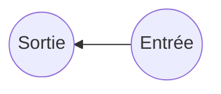

# Algorithmique

import { Download } from "@/components/Download";

*Pr Snineh Mohammed*

<Download />


## introduction
-  Les algorithmes.
-  Les langages machines.
-  Les langages évolués : pascal, C, C++, Basic, Java, Python…

-  Un compilateur ou interpréteur est nécessaire pour traduire


un programme écrit en un langage évolué en langage
machine.


## définitions


Algorithme :
-  mot dérivé du nom du mathématicien « AL KHWARIZMI » qui a
vécu au 9ème siècle, était membre d’un académie des sciences à
Bagdad .



-  Entrée : instance du problème.


-  Sortie : résultat(s)


**Définition 1:**

<div class="bg-blue-300/30 p-2 rounded-md">
-  Un algorithme représente une séquence d’instructions (Actions), logiquement
ordonnées, qui permet de résoudre un problème donné.
-  Un algorithme est lié à un problème.
</div>

```mermaid
diagram2
```


**Définition 2:**

-  Séquence d’étapes de calcul qui transforment les entrées en sortie. La
sortie représente la solution d’un problème donné.
```mermaid
digram3

```
-  Étude de la résolution de problèmes par la mise en œuvre de suites
d'opérations élémentaires selon un processus défini aboutissant à une
solution.

**ALGORITHMIQUE**
- L’algorithmique est la science des algorithmes.

- L’algorithmique s’intéresse à l’art de construire des algorithmes ainsi
qu’à caractériser leur validité, leur robustesse, leur réutilisabilité, leur complexité ou leur efficacité.

**VALIDITÉ D’UN ALGORITHME**
- La validité d’un algorithme est son aptitude à réaliser exactement la
tâche pour laquelle il a été conçu.

**ROBUSTESSE D’UN ALGORITHME**
- La robustesse d’un algorithme est son aptitude à se protéger de
conditions anormales d’utilisation.

**RÉUTILISABILITÉ D’UN ALGORITHME**
- La réutilisabilité d’un algorithme est son aptitude à être réutilisé pour
résoudre des tâches équivalentes à celle pour laquelle il a été conçu.

**COMPLEXITÉ D’UN ALGORITHME**
- La complexité d’un algorithme est le nombre d’instructions élémentaires à exécuter pour réaliser la tâche pour laquelle il a été conçu.

**EFFICACITÉ D’UN ALGORITHME**


- L’efficacité d’un algorithme est son aptitude à utiliser de manière
optimale les ressources du matériel qui l’exécute.


## ANALYSE ET RÉSOLUTION D’UN problème

```mermaid
diagram4
```


Analyser et étudier le problème à résoudre


Spécifier le modèle de Résolution :
données et les formules mathématiques


Écrire l’algorithme


Traduire l’algorithme à un programme


Exécuter le programme par un ordinateur
afin d’obtenir des résultats

## REPRÉSENTATION D’UN algorithme
- Un algorithme peut être représenté :
-  Langage humain.

-  **Le pseudo-code:**
    -  Le pseudo-code est une représentation textuelle avec une série(sans les problèmes de syntaxe)
        -  plus pratique pour écrire un algorithme.
        -  représentation largement utilisée.


-  Langage informatique.


-  Organigramme :
  Un organigramme est la représentation graphique d'un
algorithme. Les instructions sont représentées par des symboles
graphiques normalisés qui sont:

```mermaid

diagram 6
```
## VUE GLOBALE D’UN algorithme
```mermaid
diagram 7
```


## COMPOSANTS D'UN algorithme

Un algorithme est composé d'un certains nombre d'instructions qui
manipulent des données :

- Données d'un algorithme :
    Une donnée représente une information liée à un élément du
    problème traité par l’algorithme. Elle est caractérisée par 3 attributs:
    -  **Identificateur**
    -  **Valeur**
    -  **Type**


## COMPOSANTS D'UN algorithme
[](https://mermaid.live/edit#pako:eNqNkEFOwzAQRa8ymlUqtZUosAkSEmqWsCkSCzCLaT2hRrEncuwKqCpxDU6AyjVyE07CpJQ9G8v-f_73s7e4EstY4lOkdg3XCxPA2ZOHopIQ-j13o0eYTC5VmxV3FN2yUenid-honBZzCV2ikHh0MGaD4exZYXD-_f7BXYIcQJbPnGAlOhYGgWFDDecIreSNhqH_SpHBi3W105unJlQUuiHaRlE873kM_SdB5Db2-05r-NDzJrr4fu_FaYEdQg3B4upmalCJlPBIev5Potq98JDFMXqOnpzVD9rq28BgWrNng6VuLdeUm2TQhJ2OUk5y-xpWWKaYeYy5tZS4cjSwY1lT06naUrgX-TvvfgCvD4e8)

## COMPOSANTS D'UN algorithme

Snineh Mohamed

- Données : Identificateur
    - Chaque donnée (Variable ou constante) manipulée par un
algorithme est désignées par un nom unique : IDENTIFICATEUR.
    - Identificateur : c’est une chaîne de caractères alphanumérique
(contenant uniquement des caractères alphabétiques `[a-z, A-Z]` et
numériques `[0-9]`) en plus du caractère « _ » (Trait souligné) et qui
ne commence pas par un caractère numérique.

[](https://mermaid.live/edit#pako:eNptkbFOwzAQhl_l5KWN1KYCJIZQZYAulZBAKhOYwakvjSXHDs55QFXfhZE8R16MK2mhRWw-3_n_v_-8FWuvUWRiE1RTwdOtdGD0xct44Z3rO2yTV5hOc767HEsxL_KHSE2kdj4rcsmz99iCPozCW0SwI2U3PhiqauSOIVBladYVBug_uBvJWNMqwhhSuBthS2D5aei7NlpSxHJ_RKQcr7zld96BjvAYfGH7zxqlTKRIbgbgA-TVALl0J4z_IJ5ADIylj8GZA-KvtxRpcqZ_PegflwNLRxjqvtNGmcD1vJjlsN_Lz8Rg9X1sVDhP1rArpwcKyhDW6HgXpu9ARWiOKVPOKCaiZhtlNH_UltVBCqpwz5fxUWOpeHdSSLfjURXJr97dWmQUIk5EbDQnXRjFX1yLrFS25dtGuWfvj_XuC0Yxu6w)

### TYPES DE données


- Les types numériques :


- Type date : (jour/mois/année)

- Type booléen
    -  Le type booléen stocke uniquement les valeurs logiques VRAI et FAUX.
    -  On peut représenter ces notions abstraites de VRAI et de FAUX par tout ce
qu'on veut : de l'anglais (TRUE et FALSE) ou des nombres (0 et 1).

- Chaînes de caractères
    -  Les caractères sont notés entre apostrophes ou guillemets.
    -  Il contient tous les caractères utilisables (lettres, chiffres, ponctuation).
    -  Le type chaîne permet de décrire des objets.
    -  Les langages de programmation manipulent les chaînes de caractères :
    -  Concaténation
    -  Sous-chaînes
    -  …


### Les opérateurs arithmétiques :


|Opérateur|Fonction|Exemple|
|--|--|--|
|+|Addition|X+Y|
|-|Soustraction|X-Y|
|*|Multiplication|X*Y|
|/|Division|X/Y|
|^|Puissance|2^3|
|Mod|Reste division|17 mod 5 (=2)|


### Les opérateurs relationnels (de comparaison) :

|Opérateur|signification|
|--|--|
|=|Egal|
|\<> ou |Différent|
|\<|Strictement inférieur|
|>|trictement supérieur
|\<=|Inférieur ou égal|
|>=|Supérieur ou égal|


- Les opérateurs relationnels (de comparaison) :

|Opérateur|signification|
|--|--|
|NON|Non logique|
|OU|Ou inclusif|
|ET|Et logique|

### LES instructions

- Définition
Les actions élémentaires qui composent un algorithme sont
appelées Instructions, car elles représentent des ordres à
exécuter dans l'algorithme.

- Instruction d'entrée : Lire
- L'instruction Lire permet d'introduire une donnée

- Instruction de Sortie: Ecrire
L'instruction Ecrire permet de restituer (sortir) une donnée


- **EXEMPLES :**

```pascal filename="afficher.txt"

     Prix <-  Lire ("Donner le prix: ")

     Ecrire ("Net à payer :" , Net)
```


## Affectation:

Une affectation est l'opération qui permet de ranger la valeur d'une
expression dans une variable.
Dans un algorithme l'affectation est symbolisée par: ←

- **Exemples:**

```pascal

X <- 20
S <- n1+n2
X <- Y
```


### Ordre de priorité des opérateurs
Pour les opérateurs arithmétiques, l'ordre de priorité est le suivant
(du plus prioritaire au moins prioritaire) :
-  ^ : (élévation à la puissance)

-  \* , / (multiplication, division)
-  mod (modulo)

-  \+ , - (addition, soustraction)


En cas de besoin on utilise les parenthèses pour indiquer les
opérations à effectuer en priorité.


### STRUCTURES DE contrôle
Un algorithme décrit une suite d'instructions dont l'exécution ne se
fait pas toujours dans l'ordre de leur écriture. Il peut y avoir dans
certains cas des sauts de blocs d'instructions. Ces sauts sont
contrôlés par une structure appelée structure de contrôle.

- Un algorithme peut avoir trois structures:
    -  Structure séquentielle
    -  Structures conditionnelles ou alternatives
    -  Structure répétitive

### STRUCTURE séquentielle
On dit qu'un algorithme a une structure séquentielle lorsque les
instructions s'exécutent d'une manière linéaire une après une du
début jusqu'à la fin.

**Exemple**
```pascal
    Variables NT1, NT2, NT3, MOY : Réel;
    Début
    LIRE (NT1);
    LIRE (NT2);
    LIRE (NT3);
    MOY <- (NT1+ NT2+ NT3)/3;
    ECRIRE (MOY);
    Fin
```

### Structures conditionnelles
Dans un algorithme ayant une structure alternative les instructions
s'exécutent selon la réalisation d'une condition ou non.
La condition est une expression logique, elle peut être simple ou composée.

- Instruction Si … Alors … Sinon …Finsi
Elle exprime le choix entre deux séquences d'actions en fonction de la valeur
de la condition

**Syntaxes :**
```rust

Si condition alors
    // Séquence1
Finsi

Si Condition Alors
    // Séquence1
Sinon
    // Séquence2
Finsi

Si Condition Alors
    // Séquence1
SinonSi Condition alors
    // Séquence2
SinonSi Condition alors
    // Séquence3
…
Sinon
    // Séquence_n
Finsi

```
### Condition composée
Une condition composée est une condition formée de plusieurs conditions simples
reliées par des opérateurs logiques: ET, OU, OU exclusif (XOR) et NON

**Exemples**

-  x compris entre 2 et 6 : (x > 2) ET (x \< 6)
-  n divisible par 3 ou par 2 : (n mod 3=0) OU (n mod 2=0)
-  deux valeurs et deux seulement sont identiques parmi a, b et c :
(a=b) XOR (a=c) XOR (b=c)


L'évaluation d'une condition composée se fait selon des règles présentées
généralement dans ce qu'on appelle tables de vérité


### Structures alternatives imbriquées

- **Exemple :**

```rust
Si condition_1 alors
    Si condition_2 alors
    // instructionsA
    Sinon
    // instructionsB
    Finsi
Sinon
    Si condition_3 alors
    // instructionsC
    Finsi
Finsi
```


### Structure répétitive ou itérative (boucles)
- La structure répétitive permet de répéter une action ou une
séquence d’actions tant qu’une condition est vraie.

- Une structure répétitive est aussi appelée boucle

#### La boucle tantQue …faire
```rust
Tant que Condition(s) faire
    // Instruction(s)
Fin Tantque
```
- **Exemple**


Ecrire un algorithme qui demande à l’utilisateur une note comprise
entre 0 et 20 jusqu’à ce que la réponse convienne.


#### Structure répétitive La boucle Répéter … Jusqu’à
```rust
Répéter
    // Instruction(s)
Jusqu’á Condition(s)
```
- **Exemple**


Ecrire un algorithme qui permet de vérifier le mot de passe saisi au
clavier. L’utilisateur a droit à trois tentatives.
#### Notion du compteur

- Initialisation d’un compteur :
    ```rust
    Compteur <-  Vi
    ```
-  Incrémentation d’un compteur
    ```rust
    Compteur <-  Compteur + incrément
    ```

-  Décrémentation d’un compteur
    ```rust
    Compteur <-  Compteur - incrément
    ```

- **Exemple :**


Ecrire un algorithme qui calcule pour un nombre entier N (N>=0)
saisi au clavier, la somme : S=1+2+3+4+5+6+…..+N
#### La boucle Pour ……FinPour
Cette instruction permet la répétition d'un traitement un
nombre déterminé de fois. Le nombre de fois est contrôlé par
un compteur allant de la valeur initiale à la valeur finale. La
progression se fait dans l’ordre croissant ou décroissant.
```rust
    POUR Compteur <-  Vi A Vf [PAS DE Incrément] FAIRE
        // Instruction(s);
    FinPour
```
- **Exemple**


Ecrire un algorithme qui affiche les dix premiers nombres pairs.


## TYPES DE DONNÉES : tableaux
- Tableaux à une seule dimension :
     Structure de données qui permet de regrouper un ensemble de valeurs de
même type sous un même nom de variable en les différenciant par un
indice ou un index.

- Syntaxes :

```rust
    nom_tableau : type_des_éléments [borne_inférieure .. borne_supérieure]
    nom_tableau : type_des_éléments [Taille_Maximale]
```

-  La première case commence souvent par l’indice : 0
-  Par exemple, pour un tableau t de 5 entiers , on pourra écrire :

-  `t : entier [0..4]` ou bien `t : entier [5]` valeurs

- Accès aux éléments du tableau t :
    Pour accéder à un élément du tableau, il suffit de préciser entre
crochets l’indice de la case contenant cet élément : t[2]

- Affectation d’un élément du tableau t à une variable:
```rust
    A ← t[3]
```
-  Modification d’un élément du tableau t :
```rust
    t[3] ← 99
```
-  Parcours des éléments d’un tableau :
  Les algorithmes utilisent des itérations permettant de faire un
parcours complet ou partiel des différents éléments du tableau.

- Tableaux à deux dimensions :


**Syntaxes :**
```rust
nom_tableau : type_des_éléments [0..nb_lignes-1, 0 .. nb_colonnes-1]
```

-  Par exemple : Un tableau t de 3 lignes et 4 colonnes.

```rust
t : entier [0..2,0..3]
```
- Accès aux éléments d’un tableau à 2D :
```rust
    Nom_tableau[indice_ligne,indice_colonne ]
```

```rust
t[1,2]
```

- Affectation d’un élément du tableau t à une variable:
```rust
a ← t[1,2]
```
- Modification d’un élément du tableau t :
```rust
t[1,2] ← 100
```

- Parcours des éléments d’un tableau à 2D :
-  Les algorithmes utilisent l’imbrication des boucles pour parcourir le tableau à 2D.


## SOUS-ALGORITHMES
**Utilité:**
-  Découper l’algorithme en sous-algorithmes pour les raisons suivantes:
    -  Structuration;
    -  Réutilisation et partage;
    -  Pas de duplication du code
    -  Offert une meilleure lisibilité car le lecteur peut comprendre ce que fait un sous-algorithme, uniquement à la lecture de son nom.
    -  Construction des bibliothèques des sous-algorithmes.
    -  …


### Définition :

<div class="bg-blue-300/30 rounded-md p-2">

Un sous-algorithme est un bloc d’actions. Souvent il est déclaré
dans la partie entête de l’algorithme principal puis appelé dans
le corps de l’algorithme.
</div>
 

**Syntaxe :**


- Le sous-algorithme se compose :
    -  nom du sous-algorithme;
    -  liste éventuelle des paramètres et de leur type;
    -  éventuellement le type de la valeur qu'elle renvoie
    -  les déclarations locales (constantes ou variables);
    -  les instructions qui calculent le résultat à retourner;
    -  éventuellement au moins une instruction retourner qui renvoie la valeur résultat.

```rust
Sous-algorithme nom_sous_algo ([par1, par2, …]) :[type de retour du résultat]
    [Variables locales]
Debut
Actions
    [retourner résultat]
Fin
```


- Variables globales et variables locales:
    -  La portée d’une variable est l’ensemble des sous-algorithme où cette variable est connue.
    -  Une variable définie au niveau du programme principal est appelé variable globale.
    -  Une variable définie au sein d’un sous-algorithme est appelée variable locale.
    -  Lorsque le nom d’une variable locale est identique à une variable globale, la variable globale est localement masquée.
- Types des sous-algorithmes:
    -  Un sous-algorithme peut se présenter sous forme de fonction ou de procédure.
    -Une fonction est un sous-algorithme qui, à partir de donnée(s), calcul et rend à l’algorithme un et un seul sultat.
    -  Une procédure est un sous-algorithme qui affiche le(s) résultat(s) demandé(s).
- Types des sous-algorithmes:
    -  Un sous-algorithme peut se présenter sous forme de fonction ou de procédure.

- Fonctions:
    -  Une fonction est un sous-algorithme qui, à partir de données, calcul et retourne à l’algorithme un et un seul résultat.

- Fonctions Prédéfinies:
    -  Textes : Majuscule, Minuscule, Gauche, Droite, Sous-Chaine, Longueur, Concact, …
    -  Date : Année, Mois, Jour,….
    -  Math : Sin, Cos, Ent, Sqrt, Abs, Alea, Mod, …

- Fonctions définies par l’utilisateur :
    -  Une fonction est un sous-algorithme qui, à partir de données, calcul et retourne à l’algorithme un et un seul résultat.

- Déclaration d’une Fonction:
```rust
Fonction nom_fonction ([par1, par2, …]) : type de retour du résultat
    Variables
    Variables locales
    nom_var : Typevar
Debut
    // Actions
    // Retourner Resultat
Fin
```


- Procédures:

  Une procédure est un bloc d’actions nommé et déclaré dans l’entête
de l’algorithme et appelé dans son corps.
- Déclaration d’une procédure :

```rust

Procedure nom_procedure ([par1, par2, …]) :
    Variables
    Variables locales
    nom_var : Typevar
Debut
    // Actions Corps de procedure
Fin

```

- Appel d’une fonction :
    -  Par affectation : `F <- Factorielle(5)`
    -  Dans une instruction d’écriture : `Ecrire (Factorielle(5))`
    -  Dans l’instruction Si … Alors

- Appel d’une procédure:
    -  L’appel d’une procédure s’effectue en spécifiant  son nom et éventuellement ses paramètres

- Appel des sous-algorithmes:

    -  Une procédure ou une fonction peut appeler d’autres sousalgorithmes.

